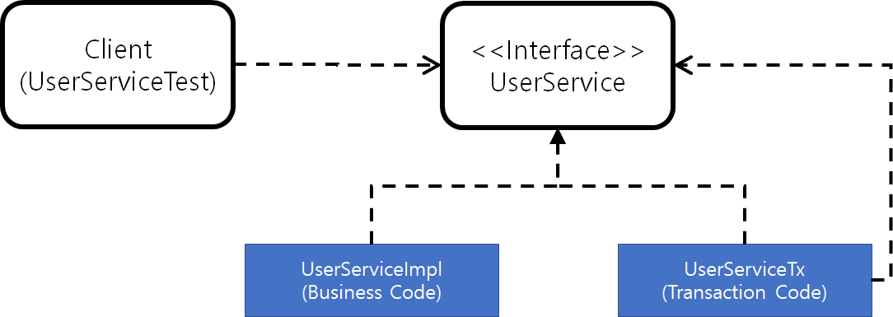

# Spring AOP!

## 스프링 3대 기반기술

1. AOP
2. IoC/DI
3. 서비스 추상화(5장)

AOP를 어디다가 쓸까?

**선언적 트랜잭션 기능을 이용해 트랜잭션 경계설정을 깔끔히 할떄(예시)**

### 기존의 코드에는...

```java

public void upgradeLevels() throws Exception {
  TransactionStatus status = this.transactionManager.getTransaction(new DeafultTransactionDefinition());
  // 트랜잭션 경계설정
  try {
    List<User> users = userDAO.getAll();

    for(User user : users){
      if(canUpgradeLevel(user)){
        upgradeLevel(user);
      }
    }
    // 비즈니스 로직

    this.transactionManager.commit();
    // 트랜잭션 경계설정(커밋)
  } catch() {
    this.transactionManager.rollback();
    throw e;
    // 트랜잭션 경계설정(롤백)
  }
}
```

뭔가 복잡하지 않은가?

비즈니스 로직은 1줄, 그리고 트랜잭션 코드가 적어도 3군데에 나누어져 더 많은 자리를 차지하고 있다.

메소드가 정의된 비즈니스로직만을 확인하기 위해서는 좀 복잡하게 보일수도 있다.

+ 트랜잭션 경계코드와 비즈니스 로직 코드간 주고받는 메시지가 존재하지 않는다.

=> 한개의 메소드 안에 두가지 각기 다른 성격의 코드가 섞여있다 => 분리 필요!!

### 두개의 메소드로 분리


```java

public void upgradeLevels() throws Exception {
  TransactionStatus status = this.transactionManager.getTransaction(new DeafultTransactionDefinition());
  // 트랜잭션 경계설정
  try {
    upgradeLevelsInternal();
    // 비즈니스 로직

    this.transactionManager.commit();
    // 트랜잭션 경계설정(커밋)
  } catch() {
    this.transactionManager.rollback();
    throw e;
    // 트랜잭션 경계설정(롤백)
  }
}

private void upgradeLevelsInternal(){
  List<User> users = userDAO.getAll();

  for(User user : users){
    if(canUpgradeLevel(user)){
      upgradeLevel(user);
    }
  }
}

```

자, 이렇게 하면 트랜잭션 코드 + 비즈니스 코드인 메소드에서 비즈니스 코드를 독립적인 메소드에 담아 분리할 수 있다.

트랜잭션 코드를 건드릴 필요도 없어졌고, 조금만 더 응용하면 앞서 공부한 콜백 패턴을 응용하여 다양한 메소드에서 트랜잭션 경계설정을 할 수 있다.

### DI를 이용한 분리

**트랜잭션 경계설정 메소드를 아예 UserSerivce에서 제거할 수 있을까**

upgradeLevels 메소드에서 사용하는 인스턴스는 transactionManager 하나밖에 없다.

게다가 꼭 필요한 코드지만, UserService에서 안보이게 하고 싶다, 클래스 밖으로 뽑아내고 싶다.

#### 일단, upgradeLevels를 호출하는 측을 보자.

책에 있는 코드에서는 테스트코드가 모든 작성한 코드들을 호출하는 방식으로밖에 구현되어 있다(Service레벨 직접 참조).

일단 직접 참조를 인터페이스를 통한 간접 참조로 교체하면 다음과 같은 구조를 가질 수 있다.

Client(UserServiceTest) ---> <<Interface>>UserService <1--- UserServiceImpl

#### UserServiceImpl, 두개

UserService 인터페이스를 두개를 다음과 같이 구현하면, 비즈니스 클래스와 트랜잭션 클래스로 구별할 수 있다.

1. UserServiceImpl(비즈니스 본질)
2. UserServiceTx(트랜잭션 경계설정)



다음과 같은 구조를 가지면 클라이언트 입장에서는 트랜잭션이 적용된 비즈니스 로직의 구현을 기대할 수 있다.

#### 구현과, 의존관계는 어떻게 할것인가.

기존에 구현해놓은 비즈니스 로직들은 UserSerivceImpl이 된다.

우선 인터페이스 정의와 UserServiceImpl은 다음과 같이 해놓은다.

```java

public interface UserService {
  void add(User user);
  void upgradeLevels();
}

public class UserServiceImpl implements UserSerivce {
  UserDAO userDao;
  MailSender mailSender;

  public void upgradeLevels(){
    List<User> users = userDAO.getAll();

    for(User user : users){
      if(canUpgradeLevel(user)){
        upgradeLevel(user);
      }
    }
  }

  public void add(User user){
    ...
  }

}


```

이제 UserServiceImpl 클래스는 `순수하게 비즈니스 로직만 존재하는` 클래스가 되었다.

그리고 UserServiceTx 클래스는 `UserSerivceImpl 클래스를 Call하기만`하면 된다.

```java

@Setter
public class UserServiceTx implements UserSerivce {
  UserService UserService;
  PlatformTransactionManager transactionManager;

  public void upgradeLevels(){
    TransactionStatus status = this.transactionManager.getTransaction(new DeafultTransactionDefinition());
    // 트랜잭션 경계설정
    try {

      userService.upgradeLevels()
      // 비즈니스 로직

      this.transactionManager.commit(status);
      // 트랜잭션 경계설정(커밋)
    } catch(RuntimeException e) {
      this.transactionManager.rollback(status);
      throw e;
      // 트랜잭션 경계설정(롤백)
    }
  }

  public void add(User user){
    userService.add(user);
  }

}
```

#### 완성된 의존관계

**Client -> UserServiceTx -> UserServiceImpl**

이런 관계가 성립된다.

UserService Bean이 의존하고 있던 transactionManager는 UserServiceTx의 Bean이, UserDAO와 mailSender는 UserServiceImpl의 Bean이 각각 의존하도록 프로퍼티 정보를 분리할 수 있다.

#### 바꿔야 할 AutoWired 설정

빈과 설정들이 바뀌었으니 AutoWired 설정도 바꿔야 한다.

수정한 스프링의 설정 파일에는 UserSerivce Interface를 implements하는 클래스가 2개가 된다. 그래서 다음과 같은 특징을 이용하면 된다.

**Type으로 Bean을 결정할 수없을 경우에는 Field Name을 이용해서 Bean을 찾는다**

Client 측 코드

```java
@AutoWired UserService userService;
//           type         id
```

수동 DI를 적용하는 테스트(직접 참조)

```java
@AutoWired UserServiceImpl userServiceImpl;
//           type         id
```

## 트랜잭션 경계설정 코드 분리의 장점

**비즈니스 로직을 담당하는 코드를 작성할 때 트랜잭션과 같은 기술적인 내용에는 신경쓰지 않아도 된다!!**

내용뿐만이 아니라 트랜잭션의 적용이 필요한지도 신경쓰지 않아도 된다.

**비즈니스 로직에 대한 테스트를 손쉽게 만들어낼 수 있다.**


### 작은, 단위, 테스트가 좋은 이유

**원인을 찾기 쉽다.**

테스트 단위가 작을 수록 만들기도 쉽고, 테스트의 의도나 내용이 분명해질 뿐더러 테스트를 실행하는 동안의 코드 실행량이 적기 때문에 어디서 문제가 발생했는지 알 수 있다.

**테스트 대상 오브젝트 고립 가능**

작성한 UserService를 그냥 테스트하게 되면, UserService가 이용하는 JDBC, transactionManager, MailSender까지 전부 테스트하게 된다.(실제 DB의 Query까지 들어간다.)

따라서 UserService를 테스트 하는 것뿐만 아니라 그 뒤에 존재하는 훨씬 더 많은 오브젝트, 환경, 서비스, 서버, 네트워크까지 함께 테스트하게 된다.

그렇게 때문에 테스트 대상 오브젝트를 고립시켜 빠르게, 부분적으로 테스트 하는것이 더 확실한 테스트 수행과 버그를 알수있다.

### 고립 방법

**Test Stub, Mock**

**Given-When-Then방법**

테스트 내용을 Given(테스트 대상 인스턴스) - When(주어진 예외상황이나 조건들) - Then(테스트 대상의 반응 확인)으로 작성하는 방법이다.

확실히 이렇게 작성을 해보니 테스트의 내용을 명확히 할 수 있으며 팀원간 컨벤션도 어느정도 지킬 수 있다.

> // Given 주석에서는 테스트에 필요한 객체와 준비를 갖추고
>
> // When에서는 일을 벌인다. 주로 테스트하려는 코드를 실행한다.
>
> // Then 주석 아래에서는 주로 When에서 발생한 일의 결과 어떤 일이 벌어졌는지 확인하는 코드가 주를 이룬다.
>
> 원한다면 verify() 메서드 등으로 가짜 객체의 어떤 메서드가 몇 번 호출됐는지 확인할 수도 있다.
>
> 때에 따라서는 코드를 이렇게 세 구역으로 나누기 모호하기 때문에 종종 // Given과 // When Then 둘로만 나누는 경우도 있다.


[https://alexecollins.com/given-when-then-junit/](https://alexecollins.com/given-when-then-junit/)

[http://d2.naver.com/helloworld/568425](http://d2.naver.com/helloworld/568425)

### 테스트 종류

#### 단위 테스트

테스트 대상 클래스를 Mock 등의 `테스트 대역`을 이용하여 `의존 오브젝트나 외부의 리소스를 사용하지 않도록 고립시켜서 테스트` 하는 것

#### 통합 테스트

두 개 이상의, `성격이나 계층이 다른 오브젝트가 연동`하도록 만들어 테스트 혹은 `DB나 파일 서비스등의 리소스가 참여하는 테스트`


### 테스트 가이드라인

1. 항상 단위테스트를 먼저 고려한다.
2. 하나의 클래스나 성격, 목적이 같은 긴밀한 클래스 몇개를 모아 외부와의 의존관계를 모두 차단하고 필요에 따라 스텁이나 목 오브젝트 등의 테스트 대역을 이용하도록 테스트를 ㅇ만든다.
3. 외부 리소스를 사용해야만 가능한 테스트는 통합테스트로 한다.
4. DAO는 DB까지 연동하는 테스트로 만드는 것이 효과적인다.
5. 여러 개의 단위가 의존관게를 가지고 동작할 때를 위한 통합테스트는 필요하다.
6. 충분한 단위테스트를 거쳤다면 통합테스트의 부담은 상대적으로 줄어든다.

## Mockito Framework

**직관적인 테스트 프레임워크**

Mock 오브젝트를 만들고 테스트하기 편하다.

* Mockito를 통한 Mock Object 생성
```java
UserDAO mockUserDao = mock(UserDAO.class);
```

* Mock 객체 행동 정의
```java
when(mockUserDao.getAll()).thenReturn(this.users);
```

* Call 횟수 검증
```java
verify(mockUserDao, times(2)).update(any(User.class));
```

### Mockito 오브젝트 사용순서

* 인터페이스를 사용해 목 오브젝트를 만든다.
* 목 오브젝트가 리턴할 값이나 반환할 예외가 있다면 지정한다.
* 테스트 대상 오브젝트에 DI해서 목 오브젝트가 테스트 중에 사용되도록 만든다.
* 테스트 대상 오브젝트를 사용한 후에 목 오브젝트의 특정 메소드가 호출됐는지, 몇번 호출됐는지 검증한다.
